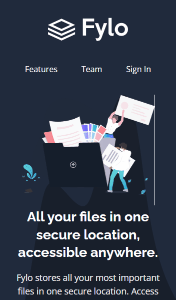

# Fylo dark theme landing page
Este é um desafio do site Frontend Mentor.   [Clique aqui](https://www.frontendmentor.io/challenges/fylo-dark-theme-landing-page-5ca5f2d21e82137ec91a50fd) para o ver.

Projeto pronto: [clique aqui!](https://marvin1423.github.io/fylo-dark-theme/)
## Visão final:

### Desktop:

## Habilidades desenvolvidas:
-   | Tags semânticas: para construção do formulário.

-  | Flexbox: ajustes dos elementos na tela e mediaqueries para cuidar da disponibilidade para todos os dispositivos

-  | Javascript: manipulação dos elementos, uso de funções, eventos ,condicionais e regex.
